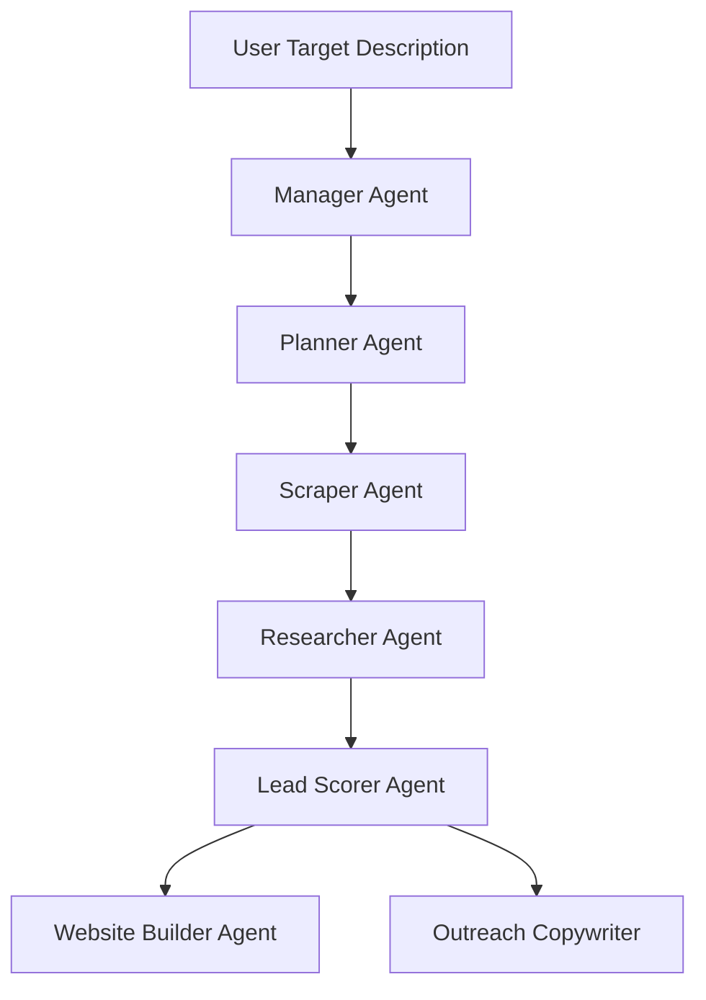

# Autonomous AI Agents System

LeadForgeAI integrates autonomous multi-agent systems to plan lead discovery, analyze target profiles, score matches, and construct outreach drafts.

## Agent Workflows

## Agent Roles

### 1. Manager Agent (`app/agents/manager`)
Supervises and coordinates workflows, delegating specific tasks to planning and scraping agents.

### 2. Planner Agent (`app/agents/planner`)
Deconstructs high-level lead criteria into actionable step-by-step scrapers and filters.

### 3. Scraper Agent (`app/agents/scraper`)
Drives searches on directory sources (Google Maps, IndiaMART, Justdial) to ingest prospective targets.

### 4. Researcher Agent (`app/agents/researcher`)
Visits websites and enriches fields (social links, team members, contact emails).

### 5. Website Analyzer (`app/agents/website_analyzer`)
Audits lead website performance, messaging, and CTA optimization gaps.

### 6. Lead Scorer (`app/agents/lead_scorer`)
Applies AI scoring to evaluate which leads match the user's ideal customer profile (ICP).

### 7. Website Builder (`app/agents/website_builder`)
Generates customizable contextual landing pages for outreach.

### 8. Outreach Agent (`app/agents/outreach`)
Drafts highly personalized emails or messages by leveraging insights discovered by the researcher and website analyzer.

### 9. Memory Module (`app/agents/memory`)
Provides vector search memory and agent state caching to ensure long-running scraping tasks remember past results.
