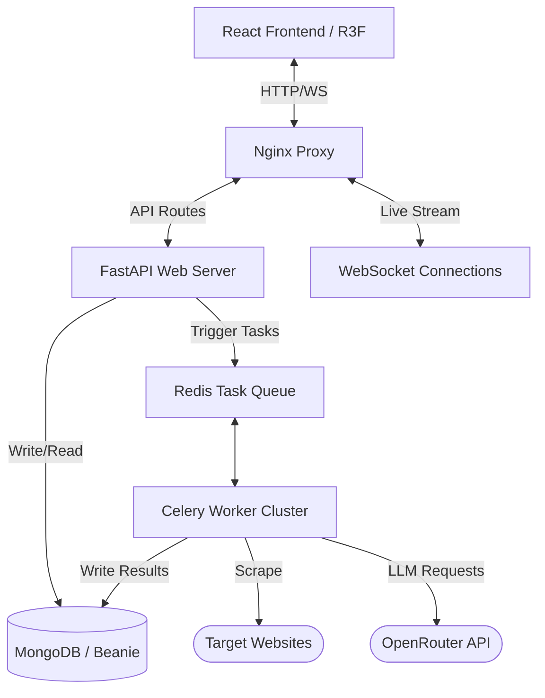

# System Architecture - LeadForgeAI

LeadForgeAI is built using a highly decoupled, modern event-driven and modular architecture designed to support heavy background processing (scraping, AI analysis) and interactive 3D frontends.

## Key Layers

### 1. Presentation Layer (Frontend)
- **Framework**: React + Vite + TypeScript.
- **Visuals**: React Three Fiber, Three.js, and Theatre.js for advanced 3D visual graphs, custom GLSL shaders, and interactive animations.
- **Transitions**: Framer Motion, GSAP, and Lenis for smooth kinetic scrolling and micro-interactions.
- **State & Data**: Zustand for global UI state, and TanStack Query for cache synchronization with the REST API.

### 2. Application Layer (Backend)
- **Framework**: FastAPI (Python 3.12).
- **Architecture**: Feature-first module layout.
- **Async Execution**: Motor driver paired with Beanie Object-Document Mapper (ODM) for database reads and writes.
- **Realtime**: WebSockets pool for scraping session live streaming.

### 3. Processing Layer (Scraping & AI)
- **Scraper**: Playwright headless browser sessions for navigating complex targets and BeautifulSoup for fast parsing.
- **AI Agents**: Modular agent nodes (Planner, Scraper, Outreach) structured to run autonomous loops with memory.
- **Queue**: Redis caching combined with Celery workers to handle heavy background workloads.
