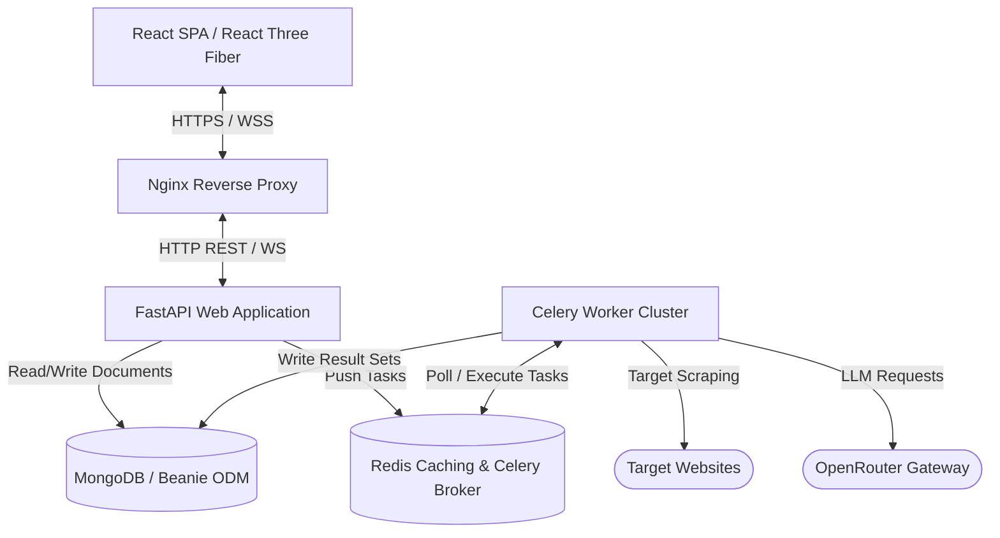
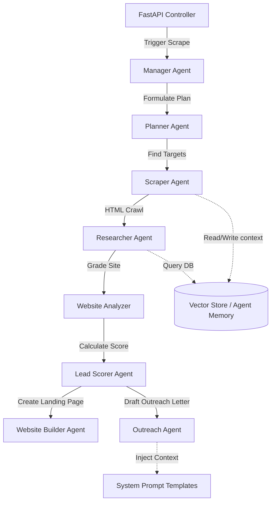

# System Architecture Blueprint - LeadForgeAI

This document provides the architectural specifications for the LeadForgeAI platform.

---

## 1. High-Level System Topology

LeadForgeAI is composed of an interactive web presentation layer, a modular REST & Real-time WebSockets API server, a background task execution engine, and a document database.



---

## 2. Layered Frontend Architecture

The client-side application is structured to decouple layout views, state engines, and cinematic WebGL layers.

```text
frontend/src/
├── app/                  # Application bootstrap and mounting logic
├── config/               # Theme presets, routing paths, and environment settings
├── providers/            # React context wrappers (Theme, Auth, TanStack Query)
├── router/               # React Router route paths and lazy page definitions
├── layouts/              # Main shells (DashboardLayout, CenterConsoleLayout)
├── pages/                # Screen entry points mapping to route definitions
├── modules/              # Feature-driven domain business components
│   ├── dashboard/        # Global metrics dashboard component trees
│   ├── leadfinder/       # Search triggers and filters UI
│   └── ...
├── components/           # Reusable atomic UI (dialogs, buttons, tables)
├── three/                # WebGL (R3F) Canvas objects, shaders, and light scopes
├── theatre/              # Cinematic animation projects and camera timeline JSONs
├── shaders/              # Vertex and Fragment GLSL scripts
├── hooks/                # Custom React hooks (useLenis, useGsap, useWindowSize)
├── services/             # HTTP API client services and interceptors
├── store/                # Zustand global states (UserStore, ScraperStore)
├── styles/               # Global CSS files and Tailwind configuration imports
└── types/                # Strict TypeScript declaration types
```

---

## 3. Layered Backend Architecture

The backend implements a highly structured, feature-first layered architecture. Business logic flows through strict boundaries.

```text
backend/app/
├── api/                  # Routing controllers exposing HTTP/WS endpoints
│   └── v1/               # Version 1 route endpoints (auth, leads, scraping)
├── modules/              # Domain-specific business logic & validation rules
│   ├── leadfinder/       # Lead verification, filters, and pipeline triggers
│   └── ...
├── engine/               # Heavy domain processing and workflow executors
│   ├── scraping_engine/  # Ingestion pipelines and playwright coordinates
│   └── ...
├── agents/               # Autonomous agent nodes, planners, and memories
├── ai/                   # OpenRouter wrappers, prompts, and LangGraph flows
├── schemas/              # Pydantic request/response validation schemas
├── database/             # Beanie ODM documents, index configs, and seeds
├── infrastructure/       # External infrastructure connectors (Redis, SMTP, S3)
├── integrations/         # External partners adapters (Bookipi, Resend, Slack)
├── observability/        # Metrics, tracing, profiling, and telemetry logs
├── shared/               # Reusable shared utilities and generic types
└── cli/                  # CLI management command definitions
```

---

## 4. AI & Agent Architecture

The AI layer wraps API gateway providers and orchestrates stateful multi-agent workflows.



- **OpenRouter/LLM Adapters**: Abstraction layer targeting diverse model providers, allowing hot-swapping models based on latency/cost parameters.
- **Short-Term Memory**: Conversation history strings stored in Redis.
- **Long-Term Memory**: Structured documents and vectors query templates.
- **Prompt Registry**: System prompt files grouped by domain (`system/`, `leadfinder/`, `outreach/`).

---

## 5. Database Architecture

- **Driver**: Async Motor wrapper.
- **ODM**: Beanie ODM using standard Pydantic models.
- **Transactions**: Supported via session routing (requires replica sets).
- **Caching**: Redis caches hot lead queries and session statuses.

---

## 6. Request Lifecycle & Real-Time Data Flow

### 6.1. HTTP API Pipeline
1. **Route Controller** receiving incoming requests.
2. **Middleware** processes CORS, security headers, tracing IDs, and authentication.
3. **Schemas** validate request payload against Pydantic models.
4. **Modules / Services** process business logic.
5. **Database Repositories** query MongoDB.
6. **Schemas** sanitize output data and return standard JSON payloads.

### 6.2. Scraper Live Streaming Flow (WebSocket)
1. Frontend opens WebSocket connection at `/ws/scraping/{job_id}`.
2. Celery Scraping task runs, writing logs and snapshots to Redis channels.
3. FastAPI WebSocket manager polls Redis channels, broadcasting updates to the client.
4. React Three Fiber viewport receives updates, displaying floating holographic status animations.
